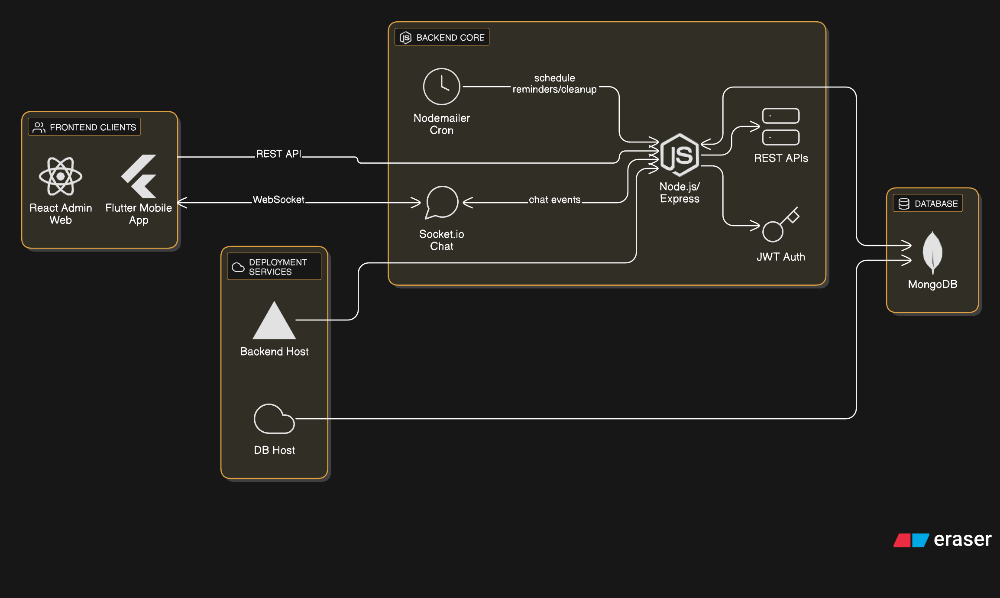

# 📅 Appointment Scheduling System

A complete **end-to-end appointment scheduling system** built as per the assignment PDF, consisting of a **Node.js backend**, a **React Admin Web Interface**, and a **Flutter Mobile App for users**, with additional enhancements like **real-time chat** and **cron-based automation**.

---

## 📌 Project Overview

This project demonstrates full-stack development skills including backend API design, frontend development (web + mobile), real-time communication, and automated background jobs.

### ✅ Core Requirements (Assignment PDF)
- ✨ Common backend (Node.js + Express + MongoDB)
- ✨ Admin Web Interface (React)
- ✨ Flutter Mobile App for end users
- ✨ Enforced business rules for appointments

### 🚀 Additional Features Implemented
- 💬 Real-time chat using **Socket.io** (User↔Admin, Admin↔Admin)
- 📧 Email-based OTP verification
- ⏰ Cron jobs for:
  - Appointment reminder emails (15 min before)
  - Auto-completion and cleanup of old appointments
- 🎨 Modern UI with toasts, modals, animations, and professional theming

---

## 🏗️ Architecture Diagram



---

**📚 [Project Interface Outputs](<https://docs.google.com/document/d/1zN78tL9e_kcb6fffLjqtqvye5XNycdMNz1VQwONQgJc/edit?usp=sharing>)**

## 🧩 System Components

### 1️⃣ Backend (Node.js + Express)
- REST APIs for appointments & admin management
- MongoDB data modeling with Mongoose
- JWT authentication & authorization
- Email services (nodemailer)
- Background cron jobs
- Socket.io server for real-time chat

### 2️⃣ Admin Web Interface (React + Vite)
- Admin login & registration
- Appointment management dashboard
- Advanced filtering by date, consultant, status
- Status updates (PENDING → CONFIRMED/CANCELLED → COMPLETED)
- Admin-to-admin real-time chat
- Modern UI with Tailwind CSS & animations

### 3️⃣ Mobile App (Flutter)
- User login with OTP verification
- Browse all consultants
- Slot selection and appointment booking
- View and manage appointments
- Real-time chat with admins
- Offline appointment history

---

## ⚙️ Tech Stack

### Backend
| Technology | Purpose |
|-----------|---------|
| **Node.js** | Runtime |
| **Express** | Web framework |
| **MongoDB** | NoSQL database |
| **Mongoose** | ODM |
| **JWT & bcrypt** | Authentication & encryption |
| **nodemailer** | Email service |
| **node-cron** | Background jobs |
| **socket.io** | Real-time communication |

### Admin Web
| Technology | Purpose |
|-----------|---------|
| **React 19** | UI framework |
| **Vite** | Build tool |
| **Tailwind CSS** | Styling |
| **Axios** | HTTP client |
| **socket.io-client** | Chat client |
| **react-toastify** | Notifications |
| **framer-motion** | Animations |

### Mobile App
| Technology | Purpose |
|-----------|---------|
| **Flutter** | Mobile framework |
| **Dart** | Language |
| **Provider** | State management |
| **http** | API calls |
| **shared_preferences** | Local storage |
| **socket_io_client** | Chat client |

---

## 📁 Repository Structure

```
panchanga/
├── backend/                    # Node.js + Express backend
│   ├── src/
│   │   ├── controllers/        # Request handlers
│   │   ├── models/             # MongoDB schemas
│   │   ├── routes/             # API routes
│   │   ├── services/           # Business logic
│   │   ├── middleware/         # Auth & validation
│   │   ├── sockets/            # Socket.io handlers
│   │   ├── jobs/               # Cron jobs
│   │   ├── config/             # Configuration
│   │   ├── utils/              # Helper functions
│   │   ├── app.js              # Express app
│   │   └── server.js           # Entry point
│   ├── .env.example
│   └── package.json
│
├── admin-web/                  # React (Vite) admin interface
│   ├── src/
│   │   ├── pages/              # Page components
│   │   ├── components/         # Reusable components
│   │   ├── context/            # Auth context
│   │   ├── api/                # API services
│   │   ├── socket/             # Socket.io config
│   │   ├── App.jsx
│   │   └── main.jsx
│   ├── public/
│   ├── .env.example
│   ├── tailwind.config.js
│   └── package.json
│
├── mobile_app/                 # Flutter mobile app
│   ├── lib/
│   │   ├── screens/            # UI screens
│   │   ├── providers/          # State management
│   │   ├── services/           # API & Socket services
│   │   ├── widgets/            # Reusable widgets
│   │   ├── models/             # Data models
│   │   ├── constants/
│   │   └── main.dart
│   ├── pubspec.yaml
│   └── android/
│
├── assets/
│   └── architecture.png        # System architecture diagram
│
└── README.md
```

---

## 🔐 Authentication Flow

```
┌─────────────────────────────────────────────────────────┐
│                 Authentication Process                   │
├─────────────────────────────────────────────────────────┤
│ 1. User/Admin registers with email                      │
│ 2. OTP sent via email (valid for 10 minutes)            │
│ 3. User verifies OTP → Account activated                │
│ 4. Login returns JWT token                              │
│ 5. JWT used for:                                        │
│    • API authorization (in Authorization header)        │
│    • Socket.io authentication (in handshake)            │
└─────────────────────────────────────────────────────────┘
```

---

## 🗂️ Backend Features

### 🔗 API Endpoints

#### Authentication
```
POST   /api/auth/register       # Register new user/admin
POST   /api/auth/verify-otp     # Verify OTP code
POST   /api/auth/login          # Login & get JWT
```

#### Consultants (Public)
```
GET    /api/consultants         # List all verified consultants
GET    /api/consultants/:id     # Get consultant details
```

#### User Appointments
```
GET    /api/appointments/my     # View my appointments
POST   /api/appointments        # Book appointment
PATCH  /api/appointments/:id/cancel  # Cancel appointment
```

#### Admin Appointments
```
GET    /api/admin/appointments  # List all appointments (with filters)
PATCH  /api/admin/appointments/:id    # Update appointment status
GET    /api/admin/users         # List all admin users
```

### 📋 Business Rules

| Rule | Details |
|------|---------|
| **Working Hours** | 10:00 – 18:00 (Mon–Fri only) |
| **Slot Duration** | 30-minute slots only |
| **No Overlaps** | One consultant per slot |
| **Daily Limit** | Max 3 appointments per user per day |
| **Status Flow** | PENDING → CONFIRMED/CANCELLED → COMPLETED (auto) |

### ⏰ Cron Jobs

**Reminder Job** (Every 15 minutes)
- Sends email 15 minutes before scheduled appointment
- Only for CONFIRMED appointments

**Cleanup Job** (Daily at 2 AM)
- Marks expired CONFIRMED appointments as COMPLETED
- Deletes COMPLETED appointments older than 30 days

---

## 🖥️ Admin Web Interface

### ✨ Features

- **Dashboard**: Overview of consultants and total appointments
- **Appointments Management**: 
  - View all appointments
  - Filter by date, consultant, and status
  - Update appointment status
  - Pagination support
- **Admin Chat**: Real-time messaging with other admins
- **Modern UI**: 
  - Responsive design with Tailwind CSS
  - Toast notifications
  - Loading states & animations
  - Professional color scheme

### 📄 Key Pages

| Page | Purpose |
|------|---------|
| **Login** | Admin authentication |
| **Dashboard** | Quick stats and overview |
| **Appointments** | Full appointment management |
| **Chat** | Admin-to-admin messaging |

---

## 📱 Flutter Mobile App

### ✨ Features

- **Authentication**: 
  - Email-based registration
  - OTP verification
  - Secure login with JWT
  
- **Consultant Browsing**: 
  - View all consultants
  - Consultant profile details
  
- **Appointment Booking**: 
  - Select date and available time slots
  - Real-time slot availability
  - Appointment confirmation
  
- **Appointment Management**: 
  - View all bookings
  - Cancel upcoming appointments
  - View appointment history
  
- **Chat**: 
  - Real-time messaging with admins
  - Message history
  - Typing indicators

### 🎨 UI Features

- Material Design 3 theme
- Bottom navigation
- Smooth transitions & animations
- Toast notifications
- Error handling

---

## 🔄 Real-Time Chat (Socket.io)

### 🔒 Security
- JWT token-based authentication
- User validation on socket connection
- Role-based room assignments

### 🎯 Features
- **Direct Messaging**: Send messages to specific users
- **User Rooms**: Each user joins a room by their ID
- **Typing Indicators**: Real-time typing status
- **Connection Status**: Live connection indicators

### 📨 Communication Patterns

```
User ↔ Admin          # User can chat with any admin
Admin ↔ Admin         # Admins can chat with each other
Role-based Rooms      # Users join by ID, broadcast by role
```

---

## 🚀 Setup Instructions

### 📋 Prerequisites
- Node.js (v16+)
- MongoDB (local or Atlas)
- Flutter (v3+)
- Android Studio or Xcode (for mobile)
- Valid SMTP credentials (Gmail, SendGrid, etc.)

---

### 1️⃣ Backend Setup

```bash
cd backend
npm install
cp .env.example .env
```

**Configure `.env`:**
```env
PORT=5000
NODE_ENV=development
MONGO_URI=mongodb://localhost:27017/panchanga
JWT_SECRET=your_jwt_secret_key_here
SMTP_HOST=smtp.gmail.com
SMTP_PORT=587
SMTP_USER=your_email@gmail.com
SMTP_PASS=your_app_password
ADMIN_MAIL=admin@panchanga.com
CORS_ORIGIN=http://localhost:5173,http://localhost:5000
```

**Start the server:**
```bash
npm run dev
```

✅ Backend runs on: **http://localhost:5000**

---

### 2️⃣ Admin Web Setup

```bash
cd admin-web
npm install
cp .env.example .env
```

**Configure `.env`:**
```env
VITE_API_URL=http://localhost:5000
VITE_SOCKET_URL=http://localhost:5000
```

**Start development server:**
```bash
npm run dev
```


---

### 3️⃣ Flutter Mobile App Setup

```bash
cd mobile_app
flutter pub get
```

**Update API Base URL** (in `lib/services/api_service.dart`):
```dart
// For Android emulator:
const String baseUrl = 'http://10.0.2.2:5000';

// For iOS simulator:
const String baseUrl = 'http://localhost:5000';

// For physical device on same network:
const String baseUrl = 'http://YOUR_COMPUTER_IP:5000';
```

**Run the app:**
```bash
flutter run
```

✅ Mobile app starts on emulator/device

---

## 🧪 Testing the System

### 📋 Test Credentials

**Admin Account:**
```
Email: admin@example.com
Password: Admin@123
OTP: Check email (development mode uses console)
```

**User Account:**
```
Email: user@example.com
Password: User@123
OTP: Check email (development mode uses console)
```

### ✅ Test Scenarios

1. **Register** → Verify OTP → Login
2. **Browse consultants** → Book appointment
3. **Admin: Filter & update** appointment status
4. **Chat**: Send message between admin and user
5. **Cancel appointment** (if within rules)

---

## 🐛 Troubleshooting

| Issue | Solution |
|-------|----------|
| MongoDB connection fails | Check `MONGO_URI` in `.env` and ensure MongoDB is running |
| Email not sending | Verify SMTP credentials and allow less secure apps (Gmail) |
| Socket.io connection error | Ensure backend is running and CORS is configured |
| Flutter API not connecting | Check base URL matches your machine IP (not localhost for emulator) |
| Admin chat not working | Verify both admins are connected to Socket.io |

---

## 📦 Deployment

### Backend (Node.js)
- Deploy to **Heroku**, **Railway**, or **Render**
- Use **MongoDB Atlas** for cloud database
- Set production environment variables

### Admin Web (React)
- Build: `npm run build`
- Deploy to **Vercel**, **Netlify**, or **GitHub Pages**
- Update API URLs to production backend

### Mobile App (Flutter)
- Build APK: `flutter build apk --release`
- Build IPA: `flutter build ios --release`
- Deploy to Google Play Store and App Store

---
